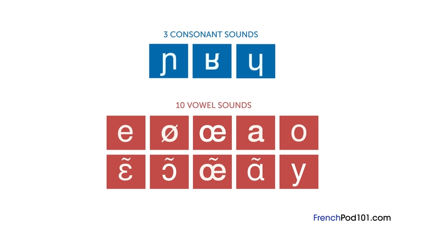
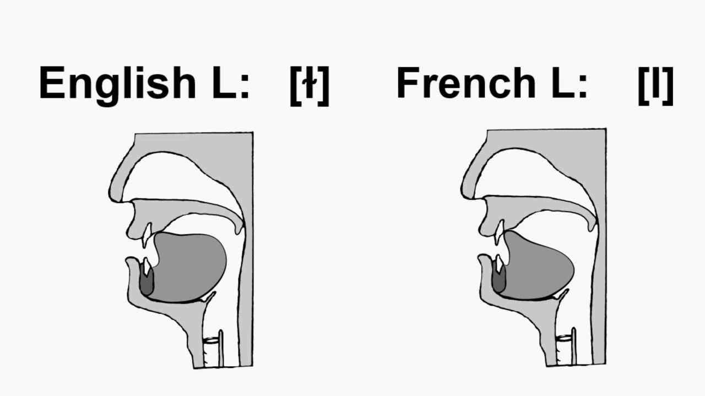
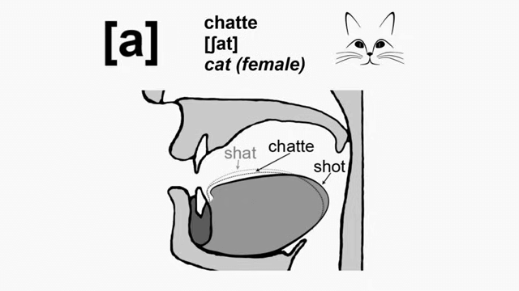
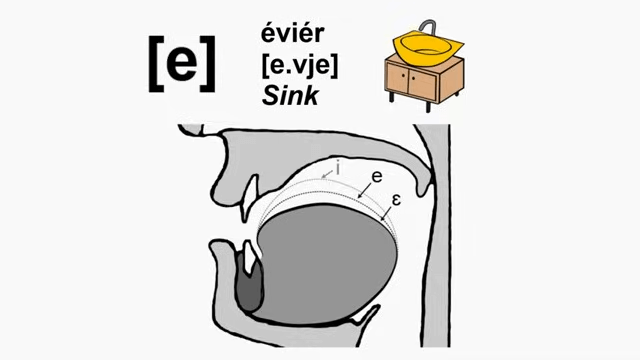
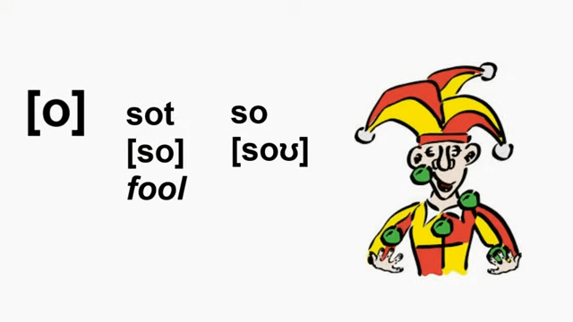
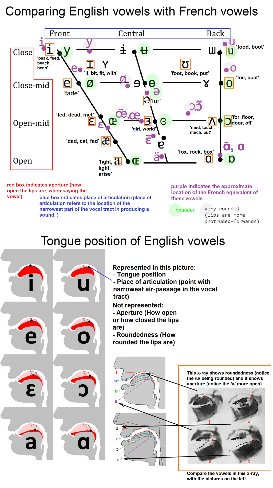

# Pronunciation

For English speakers, French requires learning 3 new consonant sounds and 10 new vowel sounds.

## Consonants

The 3 new consonants sounds for English speakers in French are the:

1. [voiced palatal nasal](https://en.wikipedia.org/wiki/Voiced_palatal_nasal) /ɲ/
2. [voiced labial-palatal approximant](https://en.wikipedia.org/wiki/Voiced_labial%E2%80%93palatal_approximant) /ɥ/
3. [Uvular r](https://en.wikipedia.org/wiki/Guttural_R) /ʁ/
   * with four different [allophones](https://en.wikipedia.org/wiki/Allophone), but the [voiced uvular fricative](https://en.wikipedia.org/wiki/Voiced_uvular_fricative) is the most common in Paris. See [this video](https://youtu.be/hI2Pso1dDjM?t=728) for a demonstration of the four allophones.

Additionally, there are slight changes to p, k, t, and l.

In French, voiceless stops /p, t, k/ are unaspirated.

Also in French, /l/ brings only the front of the tongue to the roof of the mouth whereas in English the front and back of the tongue are brought to the roof of the mouth.

## Vowels

The 10 new consonants sounds for English speakers in French are:

1. [open front unrounded vowel](https://en.wikipedia.org/wiki/Open_front_unrounded_vowel) - /a/
   * Start with "father" /fɑðɚ/ and move tongue 25% up and forward towards "fat" /fæt/.
  
2. [close-mid front unrounded vowel](https://en.wikipedia.org/wiki/Close-mid_front_unrounded_vowel) - /e/
   * Start with "put" /pʊt/ and go a little farther than "pit" /pɪt/.
   * **Letters:** -é, -ée, -er, -ez, -es (in one-syllable words)
   * **Examples:** fermé, musée, parler, parlez, les
  
3. [close-mid back rounded vowel](https://en.wikipedia.org/wiki/Close-mid_back_rounded_vowel) - /o/
   * **English:** "o" as in "no" /noʊ/, but without the /ʊ/ at the end.
   * **Letters:** au, eau, o, ô
   * **Examples:** beau, nôtre
   * 

Rounded vowels:

4. [close front rounded vowel](https://en.wikipedia.org/wiki/Close_front_rounded_vowel) - /y/
   * Start with /i/ ("ee" as in "see"), round lips and let tongue naturally move back a bit.
   * **Letters:** u
   * **Examples:** tu, salut
5. œ - [open-mid front rounded vowel](https://en.wikipedia.org/wiki/Open-mid_front_rounded_vowel)
   * Start with "bet" /bɛt/, round lips and let tongue naturally move back a bit.
6. [open-mid back rounded vowel](https://en.wikipedia.org/wiki/Open-mid_back_rounded_vowel) - /ɔ/
   * Start with English "pot" /pɔt/ and let tongue come 25% towards "pet" /pɛt/.
   * Alternatively, start with "uh", round lips and let tongue naturally move back a bit.
7. [close-mid front rounded vowel](https://en.wikipedia.org/wiki/Close-mid_front_rounded_vowel) - /ø/
   * Start with "pit" /pɪt/, round lips and let tongue naturally move back a bit.
   * **Letters:** eu, œu
   * **Examples:** peut, vœux

Nasal vowels:

8. open front unrounded nasal vowel - /ã/
9. open-mid front unrounded nasal vowel - /ɛ̃/
10. open-mid back rounded nasal vowel - /ɔ̃/

Other vowels in French which are in English include:

* /ɛ/
   * **English:** "e" as in "bet"
   * **Letters:** ai
   * **Examples:** j’aime, chaise
* /i/
   * **English:** "ee" as in "see"
   * **Letters:** i, y
   * **Examples:** merci, il y a
* /j/
   * **English:** "y" as in "yes"
   * **Letters:** i + vowel
   * **Examples:** étudiant, bière
* /u/
   * **English:** "oo" as in "moo"
   * **Letters:** ou
   * **Examples:** nous, bonjour
   * **Note:** The French /u/ is a little more back and rounded than English /u/.

Lastly, the below picture is a comparison of French and English vowels.

## Spelling Rules

1. Most final consonants are silent except for the consonants in "careful" (C-R-F-L).
2. Rule of [liasons](https://en.wikipedia.org/wiki/Liaison_(French)) - certain silent final consonants are pronunced based on rules such as grammar.
3. Hard and soft c, g, sc
   * Use hard pronunciation when followed by *a*, *o*, *u*, or another consonant.
   * Use soft pronunciation when followed by *i*, *e*, or *y*.
4. Normally 'n' and 'm' are silent and indicate nasal vowels, but 'n' and 'm' sounds occur in two scenarios:
   1. when 'n' and 'm' are before vowels (such as animal) 
   2. or when two 'n's or 'm's occur in a row (such as anniversaire)

## Videos

* [Fluent Forever - French Pronuniation](https://www.youtube.com/watch?v=hI2Pso1dDjM)
* [Fluent Forever - French Consonants](https://www.youtube.com/watch?v=83sTgHd5Iw0)
* [Fluent Forever - How to pronounce the French L (for English speakers)](https://www.youtube.com/watch?v=o061neN8qvk)
* [Fluent Forever - French Vowels](https://www.youtube.com/watch?v=dbyKzUM9H5c)
* [Fluent Forever - A Few Spelling Rules](https://www.youtube.com/watch?v=sSkNXuwFRl0)
* [French pronunciation the scientific way using International Phonetic Alphabet (IPA) & Vowel Chart](https://www.youtube.com/live/ZgNZM0ppWs8?si=QfNev9mRw73h4u4d)
* [FrenchPod101 - Learn French Pronunciation in 12 Minutes](https://www.youtube.com/watch?v=4PvBkp-4bmc)
* [Coffee Break French - Mastering French vowel sounds: 'ou' and 'u' made easy](https://coffeebreaklanguages.com/2023/10/mastering-french-vowel-sounds-ou-and-u-made-easy/)
* [Coffee Break French - Mastering French pronunciation: a comprehensive guide to the letter 'e'](https://coffeebreaklanguages.com/2023/11/mastering-french-pronunciation-a-comprehensive-guide-to-the-letter-e/)
* [Coffee Break French - A guide to liaisons in French](https://coffeebreaklanguages.com/2024/07/a-guide-to-liaisons-in-french/)
* [Coffee Break French - French liaison rules: when not to make the liaison](https://coffeebreaklanguages.com/2024/07/french-liaison-rules-when-not-to-make-the-liaison/)
* [French Pronunciation Course Playlist](https://www.youtube.com/playlist?list=PL_bt5rj27IIURNkDOqtNfyM9JclJPdwsh)

## Articles

* [French phonology](https://en.wikipedia.org/wiki/French_phonology)
* [Duolingo Blog: How to Pronounce French](https://blog.duolingo.com/how-to-pronounce-french/)

