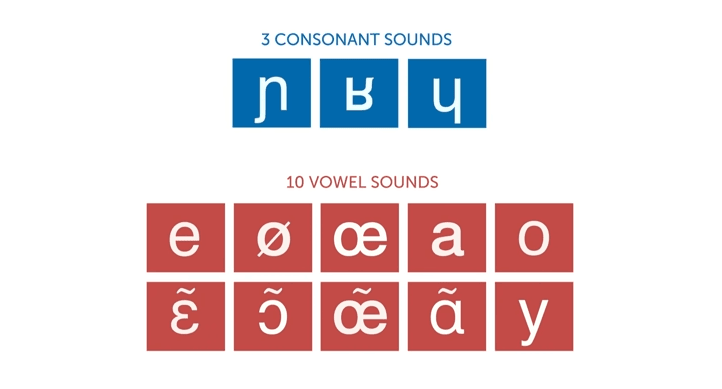

# Pronunciation

For English speakers, French requires learning 3 consonant sounds and 10 vowel sounds.

## Consonants

The 3 new consonants sounds for English speakers in French are the:

1. ɲ - [voiced palatal nasal](https://en.wikipedia.org/wiki/Voiced_palatal_nasal)
2. ɥ - [voiced labial-palatal approximant](https://en.wikipedia.org/wiki/Voiced_labial%E2%80%93palatal_approximant)
3. ʁ - [Uvular r](https://en.wikipedia.org/wiki/Guttural_R) [with four different](https://youtu.be/hI2Pso1dDjM?t=728) [allophones](https://en.wikipedia.org/wiki/Allophone):
  * Trill
  * [Voiced Fricative](https://en.wikipedia.org/wiki/Voiced_uvular_fricative) (**most common in Paris**)
  * Approximate
  * Voiceless Fricative

Additionally, there are slight changes to p, k, t, and l.

In French, voiceless stops /p, t, k/ are unaspirated.

Also in French, /l/ brings only the front of the tongue to the roof of the mouth whereas in English the front and back of the tongue are brought to the roof of the mouth.

## Vowels

The 10 new consonants sounds for English speakers in French are:

1. a - [open front unrounded vowel](https://en.wikipedia.org/wiki/Open_front_unrounded_vowel)
  * Start with "father" /fɑðɚ/ and move tongue 25% up and forward towards "fat" /fæt/.
  
2. e - [close-mid front unrounded vowel](https://en.wikipedia.org/wiki/Close-mid_front_unrounded_vowel)
  * Start with "put" /pʊt/ and go a little farther than "pit" /pɪt/.
  
3. o - [close-mid back rounded vowel](https://en.wikipedia.org/wiki/Close-mid_back_rounded_vowel)
  * 

Rounded vowels:

4. y - [close front rounded vowel](https://en.wikipedia.org/wiki/Close_front_rounded_vowel)
  * Start with /i/, round lips and let tongue naturally move back a bit.
5. œ - [open-mid front rounded vowel](https://en.wikipedia.org/wiki/Open-mid_front_rounded_vowel)
  * Start with "bet" /bɛt/, round lips and let tongue naturally move back a bit.
6. ɔ - [open-mid back rounded vowel](https://en.wikipedia.org/wiki/Open-mid_back_rounded_vowel)
  * Start with English "pot" /pɔt/ and let tongue come 25% towards "pet" /pɛt/.
  * Alternatively, start with "uh", round lips and let tongue naturally move back a bit.
7. ø - [close-mid front rounded vowel](https://en.wikipedia.org/wiki/Close-mid_front_rounded_vowel)
  * Start with "pit" /pɪt/, round lips and let tongue naturally move back a bit.

Nasal vowels:

8. ã - open front unrounded nasal vowel
9. ɛ̃ - open-mid front unrounded nasal vowel
10. ɔ̃ - open-mid back rounded nasal vowel

The French /u/ is a little more back and rounded than English /u/.

## Spelling Rules

1. Most final consonants are silent except for the consonants in "careful" (C-R-F-L).
2. Rule of [liasons](https://en.wikipedia.org/wiki/Liaison_(French)) - certain silent final consonants are pronunced based on rules such as grammar.
3. Hard and soft c, g, sc
  * Use hard pronunciation when followed by *a*, *o*, *u*, or another consonant.
  * Use soft pronunciation when followed by *i*, *e*, or *y*.
4. Normally 'n' and 'm' are silent and indicate nasal vowels, but 'n' and 'm' sounds occur in two scenarios:
  1. when 'n' and 'm' are before vowels (such as animal) 
  2. or when two 'n's or 'm's occur in a row (such as anniversaire)

## Videos

* [Fluent Forever - French Pronuniation](https://www.youtube.com/watch?v=hI2Pso1dDjM)
* [Fluent Forever - French Consonants](https://www.youtube.com/watch?v=83sTgHd5Iw0)
* [Fluent Forever - How to pronounce the French L (for English speakers)](https://www.youtube.com/watch?v=o061neN8qvk)
* [Fluent Forever - French Vowels](https://www.youtube.com/watch?v=dbyKzUM9H5c)
* [Fluent Forever - A Few Spelling Rules](https://www.youtube.com/watch?v=sSkNXuwFRl0)
* [FrenchPod101 - Learn French Pronunciation in 12 Minutes](https://www.youtube.com/watch?v=4PvBkp-4bmc)
* [French Pronunciation Course](https://www.youtube.com/playlist?list=PL_bt5rj27IIURNkDOqtNfyM9JclJPdwsh)
